# Documentación del Challenge 02 -  David Angeles

## Explora
**1. Crea un nuevo Chat con Cody.**

    - Instalada la extensión de Cody en VSCode e iniciada la sesión se muestra la extensión en el lado izquierdo de la pantalla.

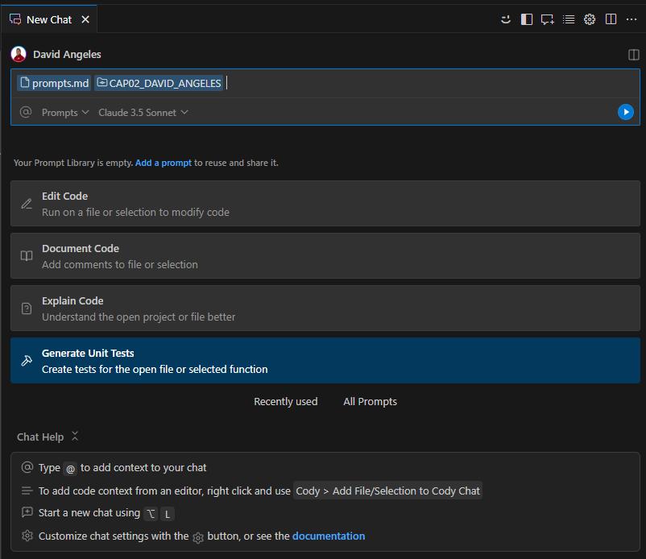

**2. Haciendo referencia al main.py dentro de /app, preguntale de qué trata el aplicativo.**
    
    - Colocandome en el main.py y en el chat de Cody seleccione la opción "Explain Code"

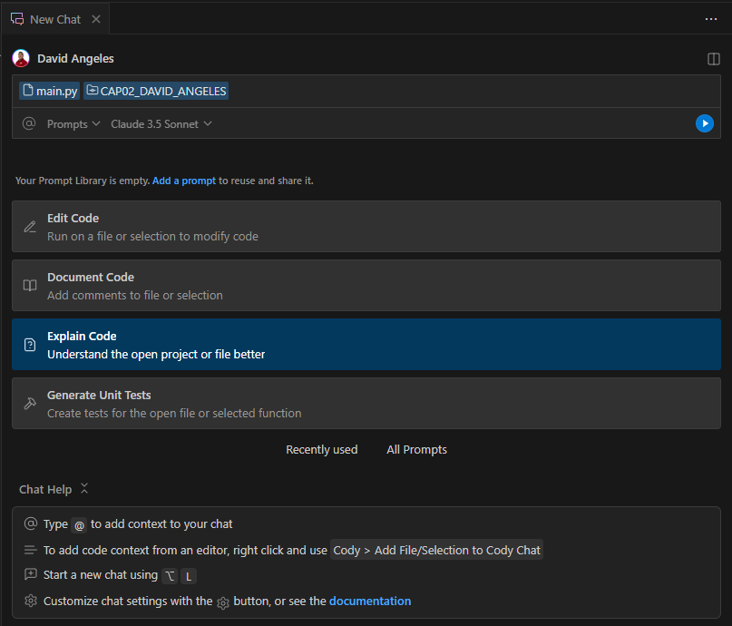

    - Cody me responde: 

    Este código es el punto de entrada principal para una API de gestión de tareas utilizando el framework FastAPI en Python. Su propósito es configurar la aplicación FastAPI y definir las rutas básicas para la API.

    El código comienza importando las dependencias necesarias: FastAPI para crear la aplicación web y tasks_router de un módulo personalizado que probablemente contiene las rutas relacionadas con las tareas.

    Luego, se crea una instancia de la aplicación FastAPI llamada "app". Esta instancia es el núcleo de la aplicación web y se utilizará para definir rutas y manejar solicitudes HTTP.

    El código incluye el router de tareas (tasks_router) en la aplicación principal. Esto significa que todas las rutas definidas en tasks_router estarán disponibles en la API, pero con el prefijo "/tasks" añadido a sus URLs. Además, se etiquetan estas rutas con la etiqueta "tasks" para una mejor organización y documentación.

    Finalmente, se define una ruta raíz ("/") utilizando el decorador @app.get(). Esta ruta responde a las solicitudes GET a la URL principal de la API. Cuando se accede a esta ruta, la función async def root() se ejecuta y devuelve un diccionario con un mensaje de bienvenida.

    En resumen, este código no toma ninguna entrada directa, pero configura la aplicación para manejar solicitudes HTTP. La salida principal es la respuesta JSON {"message": "Task Manager API"} cuando se accede a la ruta raíz. El propósito general es establecer la estructura básica de la API, incluyendo la ruta principal y las rutas relacionadas con las tareas.

## Haciendo uso de Cody
**3.1 ¿Qué hace el archivo `tasks_router.py`?**
    
***3.1.1 Opción 1***
    
    - Colocandome en el tasks_router.py y en el chat de Cody seleccione la opción "Explain Code"

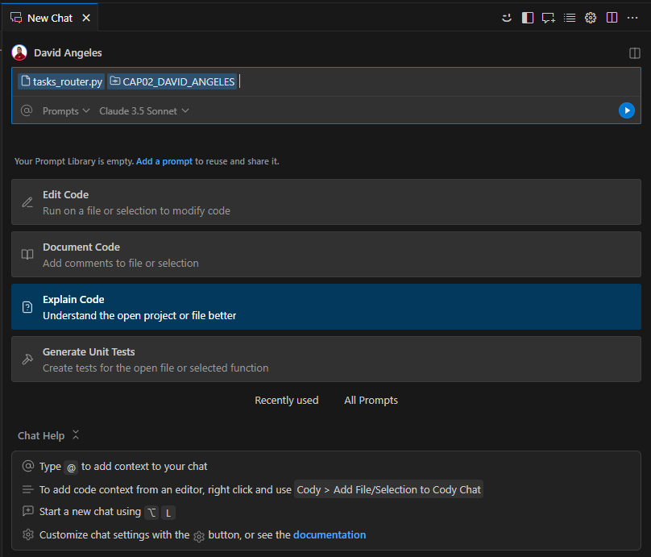

    - Cody me responde:
    Explicación del código en app\routers\tasks_router.py:

    Este código define un enrutador de tareas para una aplicación web utilizando FastAPI, un marco de trabajo para crear APIs en Python. El propósito principal de este código es manejar las operaciones CRUD (Crear, Leer, Actualizar y Eliminar) para tareas.

    El código define varias rutas HTTP que corresponden a diferentes acciones que se pueden realizar con las tareas:

    Crear una tarea: Acepta datos de una nueva tarea y la añade a la base de datos.
    Obtener una tarea específica: Recibe un ID de tarea y devuelve los detalles de esa tarea.
    Obtener todas las tareas: Devuelve una lista de todas las tareas almacenadas.
    Actualizar una tarea: Recibe un ID de tarea y los datos actualizados, y modifica la tarea en la base de datos.
    Eliminar una tarea: Recibe un ID de tarea y la elimina de la base de datos.
    Cada ruta está asociada a una función que maneja la lógica específica para esa operación. Estas funciones interactúan con un objeto de base de datos (db) para realizar las operaciones necesarias.

    Las entradas para estas funciones varían según la operación. Por ejemplo, para crear o actualizar una tarea, se necesitan los datos de la tarea. Para obtener, actualizar o eliminar una tarea específica, se necesita el ID de la tarea.

    Las salidas también varían. Generalmente, las operaciones devuelven la tarea creada o actualizada, una lista de tareas, o un mensaje de confirmación en el caso de la eliminación.

    El código maneja errores, como cuando se intenta obtener o actualizar una tarea que no existe, lanzando una excepción HTTP con un código de estado 404.

    En resumen, este código proporciona una interfaz para gestionar tareas a través de una API web, permitiendo a los usuarios realizar operaciones básicas de gestión de tareas de manera programática.

***3.1.1 Opción 2***
    - Preguntando directamente a Cody: ¿Qué hace el archivo tasks_router.py?

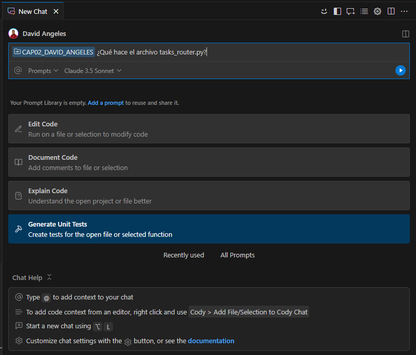

    - Cody me responde:
    El archivo tasks_router.py cumple varias funciones importantes en la aplicación:

    1. Define un router de FastAPI llamado tasks_router para manejar las rutas relacionadas con las tareas.

    2. Implementa los siguientes endpoints para operaciones CRUD (Crear, Leer, Actualizar, Eliminar) de tareas:

        - POST /: Crea una nueva tarea
        - GET /{task_id}: Obtiene una tarea específica por su ID
        - GET /: Obtiene todas las tareas
        - PUT /{task_id}: Actualiza una tarea existente
        - DELETE /{task_id}: Elimina una tarea específica

    3. Utiliza la clase FakeDB importada del módulo db para interactuar con la "base de datos" simulada.

    4. Maneja las respuestas HTTP apropiadas, incluyendo códigos de estado y modelos de respuesta.

    5. Implementa validación básica de datos utilizando los modelos Pydantic definidos en models.py.

    En resumen, tasks_router.py es el componente central que maneja toda la lógica de negocio relacionada con las operaciones de tareas en la API.

**3.2 ¿Cuáles son los diferentes endpoints y que hacen?**
    
    - Preguntando directamente a Cody como seguimiento del mismo archivo: ¿Cuáles son los diferentes endpoints y que hacen?

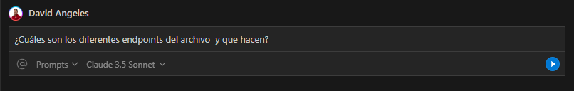

    - Cody me responde:
    Basándome en el código proporcionado en el archivo tasks_router.py, los diferentes endpoints y sus funciones son:
    
        1. POST /: Crea una nueva tarea. Recibe los datos de la tarea en el cuerpo de la solicitud y la añade a la base de datos.

        2. GET /{task_id}: Obtiene una tarea específica por su ID. Devuelve los detalles de la tarea si existe, o un error 404 si no se encuentra.

        3. GET /: Obtiene todas las tareas almacenadas en la base de datos.

        4. PUT /{task_id}: Actualiza una tarea existente. Recibe los datos a actualizar en el cuerpo de la solicitud y modifica la tarea correspondiente en la base de datos.

        5. DELETE /{task_id}: Elimina una tarea específica por su ID. Remueve la tarea de la base de datos si existe.

Estos endpoints proporcionan una funcionalidad CRUD completa (Crear, Leer, Actualizar, Eliminar) para gestionar tareas en la aplicación.

**3.3 ¿Como está construida la base de datos?**

    - Preguntando directamente a Cody como seguimiento del mismo archivo: ¿Como está construida la base de datos?

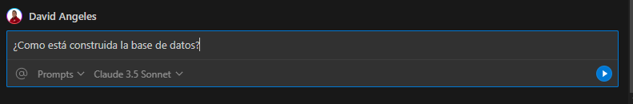

    - Cody me responde:
    La base de datos está construida de una manera simple y simulada utilizando la clase FakeDB en el archivo app/db.py. Aquí están los detalles principales:

    1. Es una implementación en memoria, no una base de datos real.

    2. Utiliza una lista Python (self.tasks) para almacenar las tareas.

    3. Proporciona métodos para realizar operaciones CRUD:

        - add_task: Añade una nueva tarea a la lista.
        - get_task: Obtiene una tarea por su ID.
        - get_tasks: Devuelve todas las tareas.
        - update_task: Actualiza una tarea existente.
        . delete_task: Elimina una tarea de la lista.
    
    4. Genera IDs automáticamente para las nuevas tareas.

    5. No persiste los datos entre ejecuciones de la aplicación.

    Esta implementación es ideal para propósitos de desarrollo y pruebas, permitiendo una rápida iteración sin necesidad de configurar una base de datos real.

**3.4 ¿Como se inicializa el aplicativo?**

    - Preguntando directamente a Cody: ¿Como se inicializa el aplicativo?

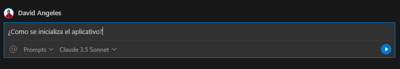

    - Cody me responde:
    El aplicativo se inicializa de la siguiente manera:

    - Se crea un entorno virtual utilizando el comando:    
        python3 -m venv venv

    2. Se activa el entorno virtual:
        En Windows:     
        .\venv\Scripts\activate

        En Unix o MacOS:       
        source venv/bin/activate

    3. Se instalan las dependencias necesarias:      
        pip install -r requirements.txt

    4. Finalmente, se ejecuta la aplicación con el siguiente comando:     
        uvicorn main:app --reload

    Este comando inicia el servidor de desarrollo de Uvicorn, cargando la aplicación FastAPI definida en el archivo main.py. La opción --reload permite que el servidor se reinicie automáticamente cuando se detectan cambios en el código, lo cual es útil durante el desarrollo.

## Extiende
**1. Añade un nuevo endpoint al aplicativo que permita eliminar TODOS los registros de db.**
    
    - En el archivo tasks_router.py, agregué un comentario que indica que se quiere añadir un nuevo endpoint para eliminar todas las tareas. Al dar un ENTER después del comentario, Cody me sugiere un nuevo endpoint para eliminar todas las tareas.

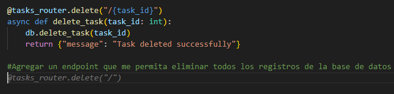

    - A continuación, Cody me sugiere que se añada un nuevo endpoint para eliminar todas las tareas y confirmo con la tecla TAB.

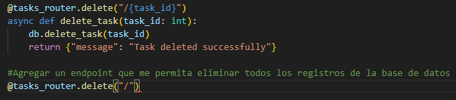

    - Al presionar ENTER, Cody me sugiere el resto del endpoint para eliminar todas las tareas.

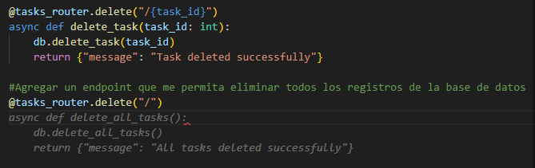

    - Confirmo con la tecla TAB.

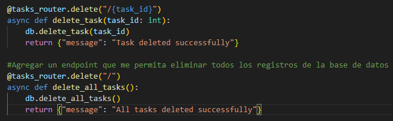

**2. Documenta el modulo `app/routers/tasks_router.py`**

***2.1 Documentando toda la clse TasksRouter***
    
    - Selecciono todo el contenido de la clase y en Cody selecciono el comando "Document Code".

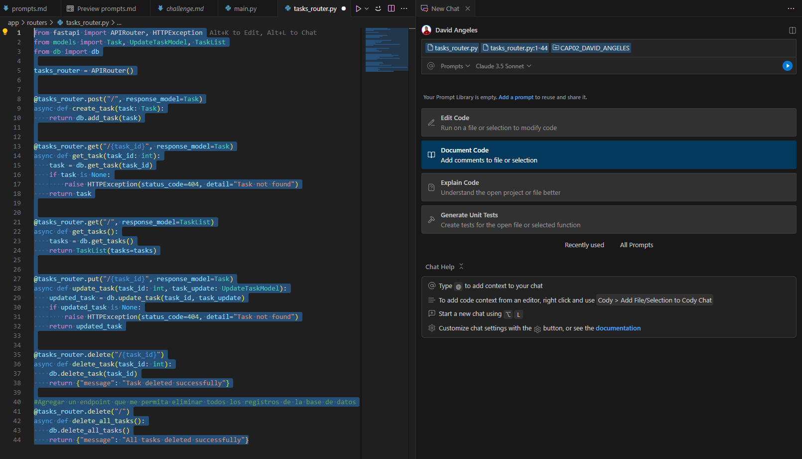

    - Cody documenta en un bloque de comentarios la descripción de la clase.

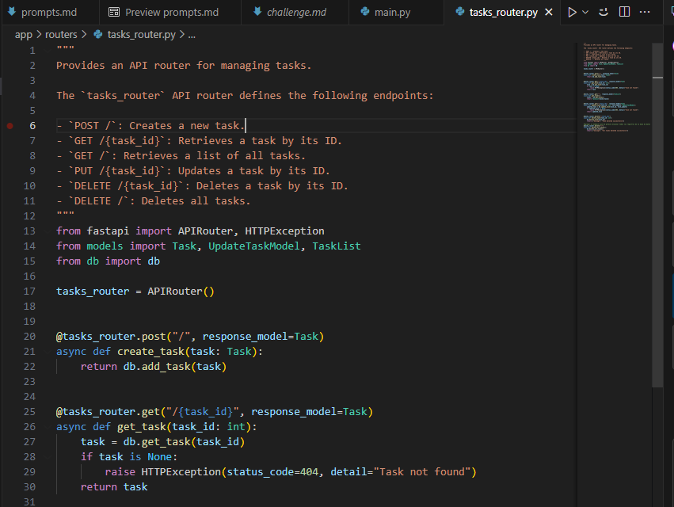

***2.2 Documentando solo un método de la clase TasksRouter***

    - Selecciono el método get_tasks y en Cody selecciono el comando "Document Code".

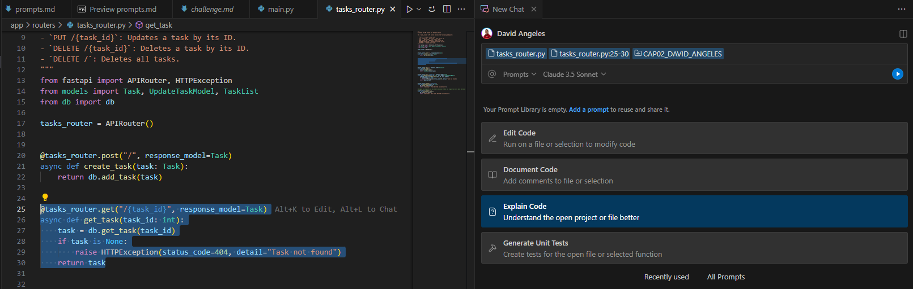

    - Cody documenta en un bloque de comentarios la descripción del método.

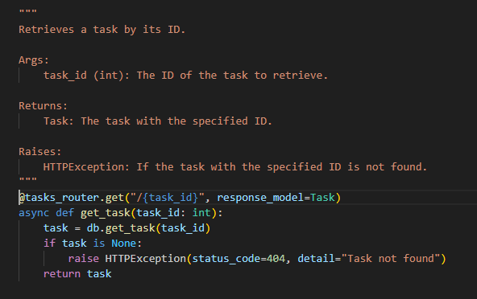

## Corrige

**1. Encuentra 5 mejoras potenciales haciendo uso del comando "Code Smells" sobre `app/routers/tasks_router.py`**

    - Selecciono toda la clase tasks_router.py y en Cody selecciono el comando "Find Code Smells".

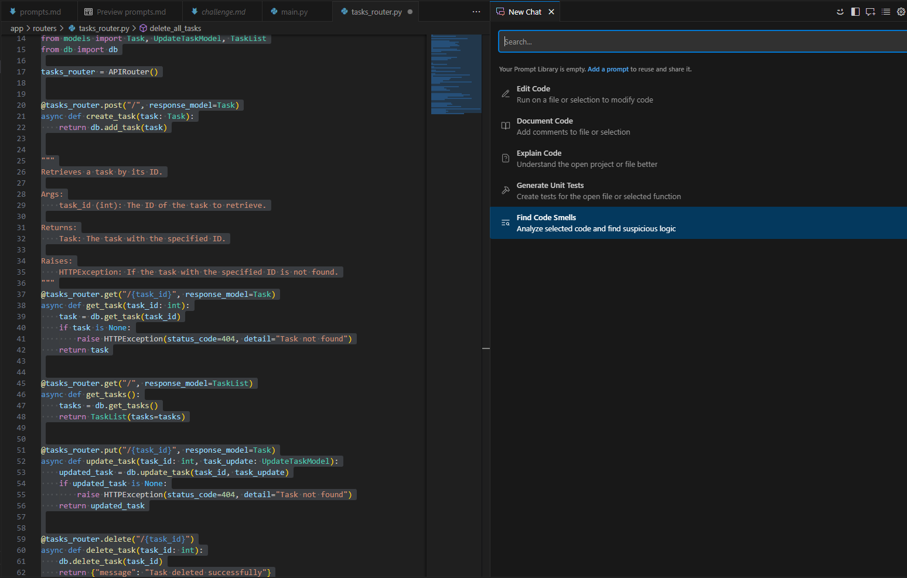

    - Cody me sugiere 5 mejoras potenciales.
    Aquí están algunas sugerencias para mejorar el código en app\routers\tasks_router.py:
    
    1. Validación de entrada: Agregar validaciones más estrictas para los datos de entrada, especialmente en las funciones create_task y update_task. Esto ayudaría a prevenir datos incorrectos o maliciosos.
    
    2. Manejo de errores: Implementar un manejo de errores más robusto, capturando excepciones específicas que puedan ocurrir en las operaciones de la base de datos. Esto mejoraría la capacidad de diagnóstico y la robustez del código.
    
    3. Documentación: Aunque hay algunos comentarios, se podría mejorar la documentación agregando docstrings a todas las funciones, no solo a algunas. Esto aumentaría la legibilidad y mantenibilidad del código.

    4. Paginación: Para la función get_tasks, considerar implementar paginación para manejar grandes conjuntos de datos de manera más eficiente. Esto mejoraría el rendimiento y la escalabilidad.

    5. Logging: Agregar logging para registrar eventos importantes y errores. Esto facilitaría el debugging y el monitoreo del sistema en producción.

    En general, el código sigue buenas prácticas de diseño y está bien estructurado. Las sugerencias propuestas son principalmente para mejorar la robustez, la eficiencia y la mantenibilidad del código. No se encontraron problemas críticos o errores significativos en la implementación actual.

**2. Implementa alguna de las mejoras propuestas por Cody AI.**

    - Selecciono el método get_tasks y en Cody selecciono el comando "Edit Code". Y pego el prompt 4 que sigirió Cody en el punto anteior. "implementar paginación para manejar grandes conjuntos de datos de manera más eficiente"

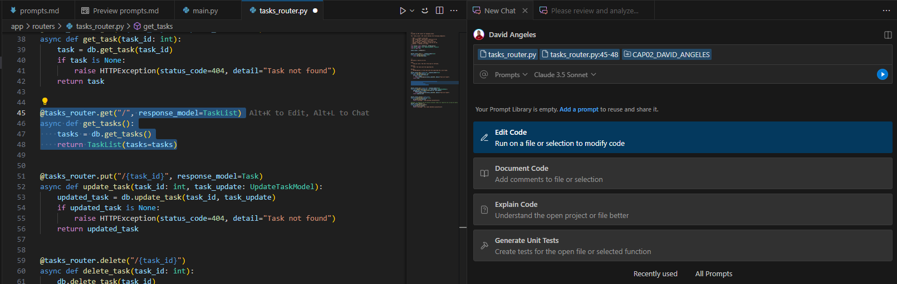

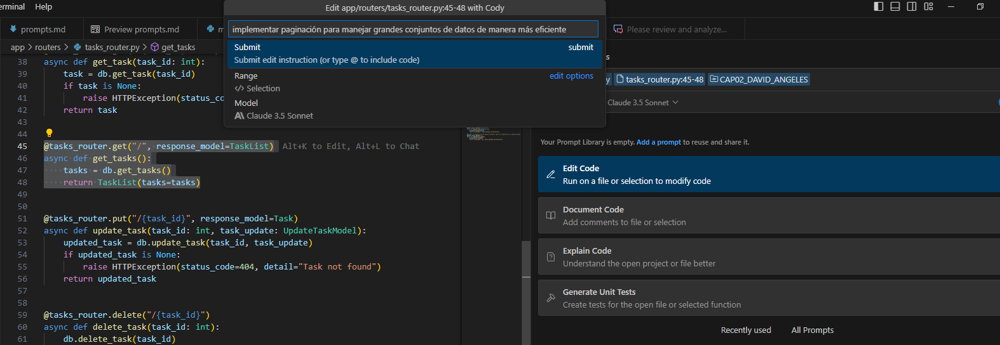

    - Cody me muestra la sugerencia de paginación.

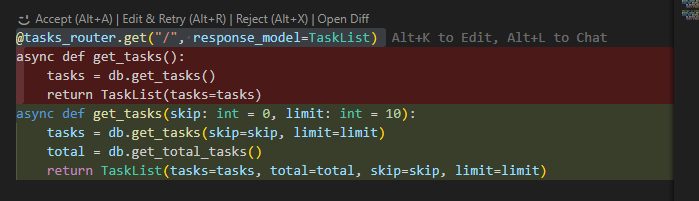

    - Confiirmo con la tecla Alt + A.

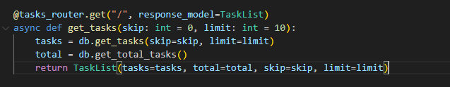